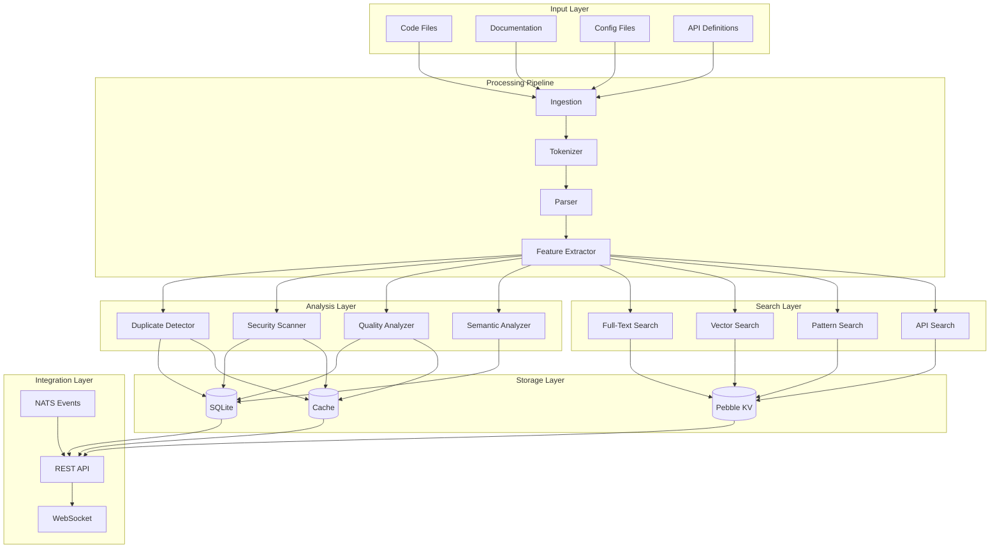

# Code Analysis & Search System (CASS) Architecture

## Overview

The Code Analysis & Search System (CASS) is a unified, reusable system that provides both static analysis and search capabilities for MetaBase. It eliminates code duplication by sharing core abstractions, algorithms, and infrastructure between traditionally separate domains.

## Core Philosophy

### 1. **Unified Abstraction**
- **Artifacts** as the central unit: Both analysis and search operate on the same `Artifact` abstraction
- **Feature Vectors** as common language: Multiple analyzers produce comparable feature vectors
- **Processing Pipeline**: Shared tokenization, parsing, and feature extraction

### 2. **Shared Infrastructure**
- **Hybrid Storage**: SQLite + Pebble for efficient indexing and persistence
- **Real-time Processing**: NATS for distributed analysis and search
- **Caching Layer**: Intelligent caching for both analysis results and search queries

### 3. **Plugin Architecture**
- **Analyzer Interface**: Pluggable analyzers for different languages and analysis types
- **Index Abstraction**: Multiple index types (full-text, vector, pattern) unified
- **Processor Pipeline**: Configurable processing stages

## Architecture Diagram



## Core Components

### 1. Engine (`/internal/analysis/engine.go`)

The central orchestrator that unifies analysis and search:

```go
type Engine struct {
    config       *Config
    storage      *storage.HybridStorage
    analyzers    map[string]Analyzer
    indexes      map[string]Index
    processors   map[ArtifactType]Processor
    cache        *AnalysisCache
    queue        chan *AnalysisTask
}
```

Key features:
- **Artifact-centric**: Everything operates on `Artifact` objects
- **Task Queue**: Asynchronous processing for scalability
- **Unified Cache**: Shared caching for analysis and search results
- **Statistics**: Comprehensive metrics for monitoring

### 2. Analyzer Interface

The core abstraction that all analyzers implement:

```go
type Analyzer interface {
    ID() string
    Name() string
    Capabilities() AnalyzerCapability
    SupportedLanguages() []string

    // Core methods shared between analysis and search
    Analyze(ctx context.Context, artifact *Artifact) (*AnalysisResult, error)
    ExtractFeatures(ctx context.Context, artifact *Artifact) ([]*FeatureVector, error)
    Compare(ctx context.Context, artifact1, artifact2 *Artifact) (*SimilarityResult, error)

    // Search support
    BuildIndex(ctx context.Context, artifacts []*Artifact) error
    Search(ctx context.Context, query *Query) ([]*SearchResult, error)
}
```

### 3. Artifact Model

The unified representation for any code element:

```go
type Artifact struct {
    ID           string
    TenantID     string
    ProjectID    string
    Type         ArtifactType    // source, binary, config, etc.
    Language     string
    Path         string
    Content      []byte
    Stage        ProcessingStage
    Features     map[FeatureType][]byte
    Metadata     map[string]interface{}
    Dependencies []string
    References   []string
}
```

## Built-in Analyzers

### 1. Duplicate Detector

**Capabilities:**
- Exact duplicate detection using fingerprinting
- Near-duplicate detection with configurable similarity thresholds
- License and attribution detection
- Pattern-based similarity

**Algorithm:**
1. **Tokenization**: Language-specific token extraction
2. **Fingerprinting**: SHA-256 based content hashing
3. **Structure Analysis**: AST-based structural similarity
4. **Similarity Scoring**: Jaccard similarity on token sets

**Usage:**
```go
detector := NewDuplicateDetector()
results, err := engine.Analyze(ctx, artifact)
duplicates, err := engine.FindDuplicates(ctx, artifact, 0.8)
```

### 2. Security Scanner

**Capabilities:**
- OWASP Top 10 vulnerability detection
- CWE-based rule engine
- Custom pattern matching
- Data flow analysis (taint tracking)

**Supported Vulnerabilities:**
- SQL Injection (CWE-89)
- Hard-coded Credentials (CWE-798)
- Insecure Random Numbers (CWE-338)
- Cross-Site Scripting (CWE-79)
- Path Traversal (CWE-22)

**Usage:**
```go
scanner := NewSecurityScanner()
result, err := scanner.Analyze(ctx, artifact)
```

### 3. Quality Analyzer

**Metrics Calculated:**
- **Cyclomatic Complexity**: Control flow complexity
- **Maintainability Index**: Combined complexity and size metric
- **Test Coverage**: Estimated test coverage
- **Documentation Ratio**: Comment-to-code ratio
- **Duplication Ratio**: Code duplication percentage

**Usage:**
```go
analyzer := NewQualityAnalyzer()
result, err := analyzer.Analyze(ctx, artifact)
```

## Search Capabilities

### 1. Full-Text Search

- **Inverted Index**: Efficient keyword search
- **Stemming & Tokenization**: Language-specific processing
- **Highlighting**: Match highlighting in results
- **Faceted Search**: Filter by language, type, date

### 2. Semantic Search

- **Vector Embeddings**: Dense vector representations
- **Cosine Similarity**: Semantic similarity matching
- **Hybrid Search**: Combine with full-text for relevance

### 3. Pattern Search

- **Regular Expressions**: Powerful pattern matching
- **AST Patterns**: Structural code patterns
- **Custom DSL**: Domain-specific pattern language

### 4. API Search

- **Endpoint Discovery**: Find API definitions
- **Usage Analysis**: Find API usage patterns
- **Signature Matching**: Function signature search

## Integration with MetaBase

### 1. Storage Integration

Leverages MetaBase's hybrid storage:

```go
// SQLite for structured data
CREATE TABLE analysis_results (
    id TEXT PRIMARY KEY,
    artifact_id TEXT,
    analyzer_id TEXT,
    type TEXT,
    findings TEXT, -- JSON
    metrics TEXT,  -- JSON
    score REAL,
    created_at DATETIME
);

// Pebble for high-performance indexes
key: "idx:feature:security:artifact123"
value: [0.1, 0.2, 0.3, ...]  // Feature vector
```

### 2. NATS Integration

Real-time events for:

- **Analysis Requests**: Distributed analysis processing
- **Search Updates**: Live index updates
- **Result Notifications**: Async result delivery

```go
// Subscribe to analysis events
nc.Subscribe("analysis.complete", func(msg *nats.Msg) {
    // Handle analysis completion
})

// Publish search events
nc.Publish("search.index", artifactData)
```

### 3. API Integration

RESTful API endpoints:

```
POST   /api/v1/analyze          # Analyze artifact
POST   /api/v1/search           # Search codebase
POST   /api/v1/duplicates       # Find duplicates
POST   /api/v1/security/scan    # Security scan
GET    /api/v1/quality/metrics  # Quality metrics
POST   /api/v1/index/build      # Build search index
WS     /api/v1/ws              # Real-time updates
```

## Performance Optimizations

### 1. Parallel Processing

- **Worker Pool**: Configurable number of workers
- **Pipeline Stages**: Parallelizable processing stages
- **Batch Operations**: Efficient bulk processing

### 2. Caching Strategy

- **Multi-level Cache**: Memory + persistent cache
- **LRU Eviction**: Intelligent cache management
- **TTL-based Expiration**: Automatic cache refresh

### 3. Incremental Analysis

- **Hash-based Change Detection**: Only analyze changed files
- **Dependency Tracking**: Smart re-analysis on dependencies
- **Delta Indexing**: Incremental index updates

## Usage Examples

### 1. Basic Analysis

```go
// Create engine
config := &Config{
    Storage:        hybridStorage,
    Workers:        8,
    CacheSize:      10000,
    EnableRealtime: true,
}
engine, err := NewEngine(config)

// Register analyzers
engine.RegisterAnalyzer(NewDuplicateDetector())
engine.RegisterAnalyzer(NewSecurityScanner())
engine.RegisterAnalyzer(NewQualityAnalyzer())

// Analyze artifact
artifact := &Artifact{
    ID:       "file-123",
    Type:     ArtifactTypeSource,
    Language: "go",
    Path:     "src/main.go",
    Content:  []byte(sourceCode),
}

results, err := engine.Analyze(ctx, artifact)
```

### 2. Advanced Search

```go
// Text search
query := &Query{
    Type:  QueryTypeText,
    Text:  "calculateSum function",
    Limit: 10,
}
results, err := engine.Search(ctx, query)

// Semantic search
query = &Query{
    Type:   QueryTypeSemantic,
    Vector: embeddingVector,
    Limit:  5,
}
results, err = engine.Search(ctx, query)

// Hybrid search
query = &Query{
    Type:       QueryTypeHybrid,
    Text:       "user authentication",
    Similarity: 0.7,
    Filters: map[string]interface{}{
        "language": "go",
        "type":     "source",
    },
}
results, err = engine.Search(ctx, query)
```

### 3. Duplicate Detection

```go
// Find duplicates
duplicates, err := engine.FindDuplicates(ctx, artifact, 0.8)

// Get similarity details
for _, dup := range duplicates {
    fmt.Printf("Duplicate found: %s (similarity: %.2f%%)\n",
        dup.ArtifactID2, dup.Score*100)
    fmt.Printf("Method: %s, Type: %s\n", dup.Method, dup.MatchType)
}
```

### 4. Real-time Integration

```go
// Setup integration layer
integrationConfig := &IntegrationConfig{
    HTTPPort:        8090,
    EnableRealtime:  true,
    EnableWebSocket: true,
}
integration, err := NewIntegration(engine, integrationConfig)

// Start services
err = integration.Start()

// Real-time analysis via NATS
nc.Publish("analysis.request", APIRequest{
    Type:    "artifact",
    Artifact: artifact,
})
```

## Extending the System

### 1. Custom Analyzer

```go
type CustomAnalyzer struct {
    *BaseAnalyzer
}

func NewCustomAnalyzer() *CustomAnalyzer {
    return &CustomAnalyzer{
        BaseAnalyzer: NewBaseAnalyzer(
            "custom-analyzer",
            "Custom Code Analyzer",
            "1.0.0",
            CapabilityAnalyze|CapabilitySearch,
        ),
    }
}

func (c *CustomAnalyzer) Analyze(ctx context.Context, artifact *Artifact) (*AnalysisResult, error) {
    // Implement custom analysis logic
    result := &AnalysisResult{
        ArtifactID: artifact.ID,
        AnalyzerID: c.ID(),
        Type:       "custom",
        Findings:   []Finding{...},
        Metrics:    map[string]float64{...},
    }
    return result, nil
}

// Register custom analyzer
engine.RegisterAnalyzer(NewCustomAnalyzer())
```

### 2. Custom Index

```go
type CustomIndex struct {
    // Index implementation
}

func (c *CustomIndex) Index(ctx context.Context, artifact *Artifact) error {
    // Implement custom indexing
}

func (c *CustomIndex) Search(ctx context.Context, query *Query) ([]*SearchResult, error) {
    // Implement custom search
}

// Register custom index
engine.RegisterIndex("custom", &CustomIndex{})
```

## Configuration

```yaml
analysis:
  # Engine configuration
  workers: 8
  batch_size: 100
  cache_size: 10000
  vector_dim: 256

  # Analyzer configuration
  duplicate_detector:
    enabled: true
    min_lines: 5
    threshold: 0.8

  security_scanner:
    enabled: true
    rules_dir: "/etc/security/rules"

  quality_analyzer:
    enabled: true
    complexity_threshold: 10

  # Search configuration
  search:
    full_text:
      enabled: true
      stemming: true
    semantic:
      enabled: true
      model: "sentence-transformers"
    pattern:
      enabled: true
      max_matches: 1000

  # Integration configuration
  integration:
    http_port: 8090
    enable_websocket: true
    enable_realtime: true
    max_connections: 1000
```

## Best Practices

### 1. Performance

- **Batch Operations**: Use batch APIs for multiple artifacts
- **Caching**: Enable multi-level caching for frequent queries
- **Async Processing**: Use async APIs for long-running analyses
- **Resource Limits**: Configure appropriate worker counts

### 2. Accuracy

- **Language-specific Analyzers**: Use language-tuned analyzers
- **Custom Rules**: Add domain-specific security and quality rules
- **Threshold Tuning**: Adjust similarity thresholds for your codebase
- **Regular Updates**: Keep security rules updated

### 3. Scalability

- **Distributed Processing**: Use NATS for distributed analysis
- **Sharding**: Partition large codebases by project/language
- **Incremental Updates**: Only process changed artifacts
- **Resource Monitoring**: Monitor CPU, memory, and storage usage

## Future Enhancements

1. **Machine Learning Integration**: ML-based anomaly detection
2. **Graph Analysis**: Code dependency graph analysis
3. **Cross-language Analysis**: Multi-language pattern matching
4. **IDE Integration**: Real-time IDE plugin
5. **Cloud Integration**: Cloud-native deployment options
6. **Advanced Visualizations**: Interactive analysis dashboards

## Conclusion

The Code Analysis & Search System (CASS) provides a unified, scalable foundation for both static analysis and search in MetaBase. By sharing core abstractions and infrastructure, it eliminates duplication while providing powerful, extensible capabilities for code understanding and discovery.

The architecture is designed to:
- **Scale**: Handle large codebases efficiently
- **Extend**: Easy to add new analyzers and search methods
- **Integrate**: Seamless integration with MetaBase's infrastructure
- **Perform**: Optimized for both analysis accuracy and search speed

This system serves as the foundation for advanced code intelligence features in MetaBase, enabling developers to better understand, maintain, and discover code across their projects.